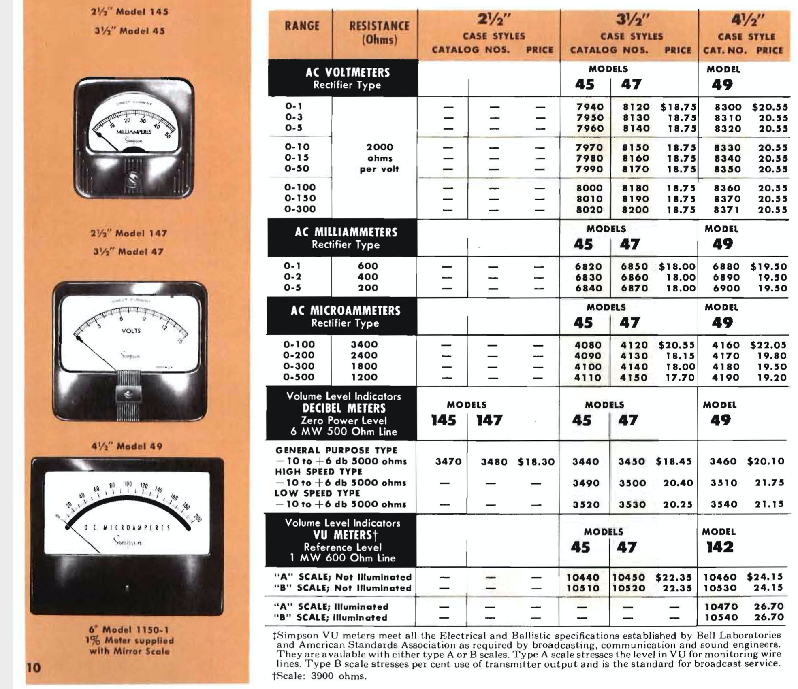
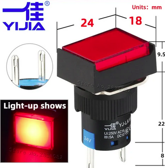

# The DIY Dash Gauges

This is a custom built prop; there is no complete kit available. 

CircuitSetup at this point only offers the [bezel](https://circuitsetup.us/product/delorean-time-machine-dash-plutonium-gauge-bezel/); a Control Board which allows using a wide range of meters will be available soon. This prop was made to be compatible with the CircuitSetup line of movie props ([Time Circuits Display](https://tcd.out-a-ti.me), [Flux Capacitor](https://fc.out-a-ti.me), [SID](https://sid.out-a-ti.me)).

This manual is in transition; the new Control Board is near the end of its design stage but below document is not fully updated yet.

The Panel consists of several parts:
- Aluminium (Aluminum for Americans) enclosure; the measurements are in the ["enclosure"](/DIY/enclosure) folder of this repository. Can be bought at [CircuitSetup](https://circuitsetup.us/product/delorean-time-machine-dash-plutonium-gauge-bezel/) (does not fit model 142 gauge, see [here](#roentgens)).
- The gauges: The smaller gauges depicted are H&P 631-14672 (built by Phaostron) and the "Plutonium chamber" gauge is a Simpson 49L VU Meter. Movie-accurate faces for these gauges are in the ["faces-labels"](/DIY/faces-labels) folder of this repository.
- A Control Board

### Control board

The Control board is mounted on the smaller gauges. Its features include
- 5V or 12V power supply (12V needed for digital gauges)
- audio, with speaker connector
- SD card slot
- a DAC for driving "analog" gauges with arbitrary voltages between 0 and 5V, and support for "digital" gauges (0/12V); room for user-mountable resistors to adjust voltage to gauge type used
- "Legacy" connector with pins for 12V digital Roentgens gauge, 12V Roentgens backlight, 12V "Empty" LED,
- Time Travel button, plus an additional multi-purpose button ("Button 1"); Time Travel connector for external button
- Connector for two Door Switches, for Door-Sound play back.

#### "Analog" vs. "Digital" gauges

The terms "analog" and "digital" have the following meaning in this document:

"Analog" gauges are ones that can show arbitrary values, ie move their pointers to arbitrary positions by using variable voltages. Best suited are voltmeters or VU-meters. Voltmeters can be usually driven with minimal voltages, even if their scale is far beyond that. It is mostly a matter of removing the meter's internal resistor(s), and putting suitable resistors on the Control Board. The Control Board can provide up to 5V and has room for two through-the-hole resistors per gauge. The firmware can easily be extended to define custom analog gauge types as regards their voltage range.

"Digital" gauges are ones that can only be controlled by power-on and power-off for "full" and "empty" pointer positions, respectively; this is useful if the gauge needs voltages beyond what the Control Board can provide (which is, as said, 5V), and is driven using external power and through a relay. One might also come up with the idea to create a gauge replica using a stepper motor and some logic to move the pointer to a fixed position on power-on, and reset it to the "Empty" position on power-loss. 

Digital gauges are presumed to require 12V, fed through the "DG+" and "-" pins of the three-pin 12V connector; in that case it is recommended to supply the entire Control Board with 12V through said connector, with the "DG+" and "+" pins shorted.

#### Control Board Hardware Configuration

In order to make the Control Board as versatile as possible, there are some solder jumpers (ie adjacent solder pads which are connected using solder), and easy-to-solder through-the-hole resistors which need to be added by the end user:

Gauge illumination:
- "Light Power": Solder jumpers for internal or external gauge illumination power: Connect either INT or EXT. For 5V lighting, close INT. To use external power (max. 12V), close EXT and connect the power supply to "Ext. Light Power". If all gauges are lit through LEDs, INT is preferred.
- LED1, LED2: Backlight LEDs for left and center gauge. These are soldered to the back of the Control Board so they directly stick into the gauge's enclosure (which naturally requires a hole in that enclosure, see below).
- R7, R8: Resistors for backlight LEDs of left and center gauge. The supply voltage is 5V (INT) or whatever you connect to "Ext. Light Power" (EXT). The resistor value depends on LED type and desired brightness. Example: 150R for yellow LEDs at 5V (INT). A calculator for the resistor value is [here](https://www.digikey.at/en/resources/conversion-calculators/conversion-calculator-led-series-resistor).
- R11: Resistor for Roentgens backlight on "Roentgens Light" connector [2]. When incandescent light bulbs are used, just bridge this. The supply voltage is 5V (INT) or whatever you connect to "Ext. Light Power" (EXT).

Hardware configuration for "analog" gauges:
- Left gauge ("Primary"):
  - R3, R4: Populate depending on gauge and supply voltage; see below
  - Close ANA4 solder jumper; DIG4 must be open
  - Leave "DIG3" unconnected/open
- Center Gauge ("Percent Power"):
  - R1, R2: Populate depending on gauge and supply voltage; see below
  - Close ANA2 solder jumper; DIG2 must be open
  - Leave "DIG1" unconnected/open
- "Roentgens" gauge (connected to "Analog Roentgens" connector [3]):
  - R5, R6: Populate depending on gauge and supply voltage;
  - (DIG5: Does not matter, has no influence on this connector)

Configuration for digital gauges (requires 12V power):
- Left gauge:
  - R3, R4: Leave unpopulated or remove
  - Bridge DIG3 by wire (or resistor, depending on gauge type)
  - Close DIG4 solder jumper; ANA4 must be open
- Center gauge:    
  - R1, R2: Leave unpopulated or remove
  - Bridge DIG1 by wire (or resistor, depending on gauge type)
  - Close DIG2 solder jumper; ANA2 must be open
- Roentgens gauge (connected to "Digital Roentgens" connector [6], pins 1 (+) and 2 (-)):
  - Bridge DIG5 by wire (or resistor, depending on gauge type)
  - (R5/R6: Don't matter, have no influence on this connector)
  

You can mix analog and digital gauges; the firmware provides a type selection for each single gauge.

### Gauges

#### "Primary", "Percent Power"

For the smaller gauges I used two H&P 631-14672 (built by Phaostron). The pointers on these are red, but an Edding permanent marker was quickly able to change them to black. I have also tested a few other types.

Tested meter options and configuration:

<table>
  <tr><td>Meter</td><td>Modification</td><td>R1/R2, R3/R4</td><td>Gauge type setting</td></tr>
  <tr><td>H&P 631-14672 0-0.5V DC voltmeter</td><td>None</td><td>470R/8k2</td><td>H&P 631-14672</td></tr>
  <tr><td>Phaostron 0-5KV DC voltmeter (300-07970)</td><td>None</td><td>470R/4k7</td><td>Generic Analog (0-5V)</td></tr>
  <tr><td>Phaostron "Cyclic Trim" meter (631-15099)</td><td>The two resistors and the pot inside the meter need to be removed, and the wire (which lead to the pot) needs to be re-attached to the input terminal.</td><td>470R/4k7</td><td>Generic Analog (0-5V)</td></tr>
</table>

Unusable:
- Phaostron 0-50/100/250/500A AC ammeter (639-16341).

It is hard to tell what a meter has inside and whether it's usable. Many meters have scales that don't match their actual input, and require an external "multiplier" (such as the 5KV voltmeter I tested). Avoid ammeters (Ampere meters) for currents >1A, and AC voltmeters for high voltages (>50V); those often have stronger coils that cannot be used with low voltages. Otherwise, ammeters (especially if the scale is in the milliampere range) can most likely be used after removing shunts, resistors or anything else that is between the two input terminals. 

To find out a suitable resistors value, use a common 5V power supply (eg one for Arduino), and start out with a 8k2 resistor between the + output of the power supply and the + of the gauge (usually the left terminal when looking at the back), and work your way from there, until the 5V plus the resistor make the pointer move to the right end of the scale (but not beyond!).

Movie-accurate dials for those gauges are available in the [DIY/faces-labels](/DIY/faces-labels) folder in this repository.

For illumination, I drilled a 6mm hole in the rear of the metal enclosure (center: 7mm from barrel bottom edge), and put a 5mm yellow LED (590nm) on the Control Board. Most replicas use white LEDs, but I think on the A-Car as shown in the Petersen Museum, there are yellow ones used, and I found white ones too bright. The LEDs are mounted on the board and they stick out approx 12mm from PCB to the LED's top.

#### "Roentgens"

The big "Roentgens" gauge is more of a problem. The original in the movie was a real Roentgens meter from a CP95 radiac. Such devices are hard to find, let alone one with the correct Simpson meter. The CP95 was built over a long period of time and they used meters from different manufacturers.

Since I could not find a properly equipped CP95, I searched for an alternative ... and came across a lot of Simpson meters that looked good (while not identical). However: One - quite important - issue is that most Simpson meters are not illuminated. Because of this, their front is a whopping 7mm thinner, the glass is much closer to the dial, and, as a result, the movie-accurate "Empty" light won't fit.

A word on Simpson model numbers: Their main model number means "case style", not "type of meter". "Model 49" therefore only means "4.5 inch case", but not whether this is a VU meter, a voltmeter, or what not:

To make things worse, they re-used other codes (such as "SK 525-447") for a variaty of meters, so that isn't an ID of a specific model either.

The only Simpson meters that came with illumination - apart from the Roentgens meters - were apparently their VU meters, models 49 (not listed above as they pre-date the catalog) and 142 (10470, 10540). Model 49 has the correct front dimensions; depending on their build date, they have either the three bands of "stripes" (like in the movie), or one thicker band of "stripes" in the center. Later models, unfortunately using the same model number, look entirely different.

I was lucky to score a **Simpson model 49L VU-meter** with the movie-accurate front, and later a **Simpson model 49MC VU-meter**. They are illuminated through two 6V incandescent light bulbs. The additional red pointer was added by drilling a hole into the front and putting a pointer from another meter inside, held by a screw. This red pointer is not moving, so it is reasonably easy to add.

The **model 142 VU-meters**, while perfectly usable electronically, are a bit smaller (4.25x3.9" vs 4.66x4.2") and look different on the back; their barrel is thicker (3.25" vs 2.78" in diameter), and the screws are not at the outer corners but closer to the barrel. There are special files in the DIY/enclosure folder for model 142 dimensions. Unfortunately, the barrel is so big that it does not allow for a simple hole for the "Empty" light; this must be done another way.

If you can't find a model 49 VU-meter or consider the 142 too far off, you could try going with a Simpson voltmeter or ammeter (models 29, 39, 49, 59, or 79 fit size-wise). These meters mostly are for voltages/currents beyond what we have available directly, but: Most of those meters can be modified easily: For instance, the **Simpson model 49 0-50V DC voltmeter** has a 50K resistor inside; if this resistor is bridged, the meter shows full scale at 0.0375V. With a 5K6 or so resistor is shows full scale at approx 5V, which is perfectly usable for our purposes. But again: You also need to compromise on the "Empty" light, since non-illuminated Simpson meters are too thin.

Tested meter options and configuration:

<table>
  <tr><td>Meter</td><td>Modification</td><td>R5/R6</td><td>Gauge type setting</td></tr>
  <tr><td>Standard VU meter (Simpson 49(L/MC), 142)</td><td>None</td><td>330R/3k3</td><td>Standard VU-Meter</td></tr>
  <tr><td>Simpson model 49 0-50V DC voltmeter</td><td>Internal resistor needs to be bridged</td><td>0R/5k6</td><td>Generic Analog (0-5V)</td></tr>
  <tr><td>Simpson model 49 0-250mA DC ammeter</td><td>Internal coil in the rear, close to the bottom, needs to be removed: No need to take the meter apart; just cut the two blank wires leading from the terminals towards the center, the coil will fall out then (be sure to bend down the remaining stubs so that they don't touch anything), the resistor can remain.</td><td>0R/1k0</td><td>Generic Analog (0-5V)</td></tr>
</table>

Unusable:
- Simpson model 49 voltmeter 0-250V AC.

Most Simpson meters have a drop-shaped pointer top which I was not able to remove (in fact, I didn't even try; I don't think the pointer top would have ended up properly straight); although I mounted the "Empty" light as high on the scale as possible, the pointer was still too long and collided with the light. My solution was to change the bends of the pointer where it leaves the driving mechanism more into an "S" shape, and I could thereby make it ever so short enough to pass the light. Another way would be to cut off the drop part, but that would make the pointer a tad too short in my opinion.

Regarding the "Empty" light: I used a light like this one (12V version), available from aliexpress:

There are also buttons that look identical and can be used instead:

The LED in those lights/buttons requires 12V. The Control Board has two connectors for the Empty LED:
- When using the "Empty Light" [4] connector, the light/button's resistor needs to be removed: Pull up the red cover and pull out the LED; then desolder the LED and bridge the resistor.
- When using the LED pins of the Digital Roetgens connector [6]: No modification of light/button needed, but the Control Board must be run with a 12V power supply. When using 5V, the LED will stay dark.

About the hole for the "Empty" light: Above light/button requires a 16mm hole. The center of this hole is, looking at the meter from the front, with the dial removed, 11mm above the edge of the barrel. When looking at the back, the center is 9mm above the barrel. Start with the hole in the enclosure, then mount the dial. mark the hole on the back of the dial, then remove the dial again and make the hole there.

### Enclosure

The enclosure consists of three parts: The front and two side pieces. Measurements are in the [DIY/enclosure](/DIY/enclosure) folder of this repository.

You can buy an enclosure at [CircuitSetup](https://circuitsetup.us/product/delorean-time-machine-dash-plutonium-gauge-bezel/); note that it is for a model 49 panel meter ('Roentgens'); a model 142 won't fit.

### Connecting a Time Travel button

The Control Board has a Time Travel button (marked "TT"). If you want to connect an external Time Travel button, connect it to the "TT" and "3V3" pins of the "Time Travel" connector.

### Connecting a TCD to the Dash Gauges by wire

If you want to connect a TCD to the Dash Gauges by wire (such as mentioned [here](https://github.com/realA10001986/Dash-Gauges/tree/main#connecting-a-tcd-by-wire)), wire as follows:

<table>
    <tr>
     <td align="center">Dash Gauges</td>
     <td align="center">TCD with control board 1.2</td>
     <td align="center">TCD with control board 1.3</td>
    </tr>
   <tr>
     <td align="center">GND of "Time Travel" connector</td>
     <td align="center">GND of "IO14" connector</td>
     <td align="center">GND on "Time Travel" connector</td>
    </tr>
    <tr>
     <td align="center">TT of "Time Travel" connector</td>
     <td align="center">IO14 of "IO14" connector</td>
     <td align="center">TT OUT on "Time Travel" connector</td>
    </tr>
</table>

