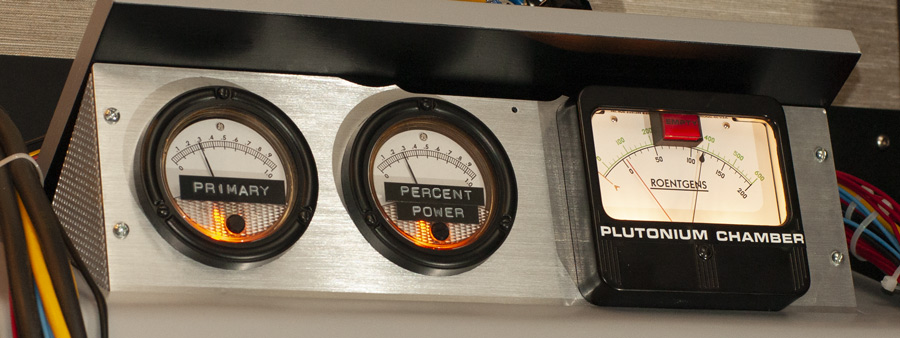
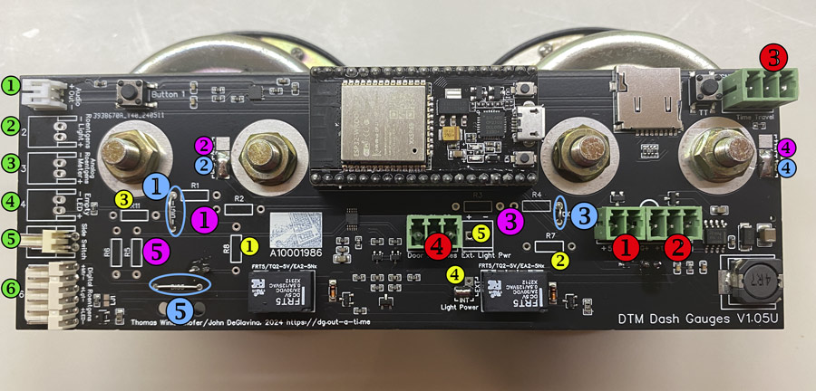
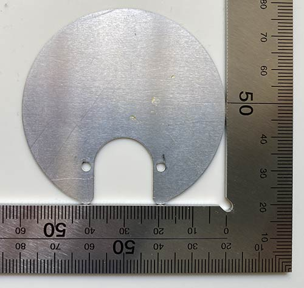
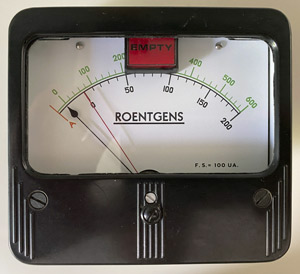
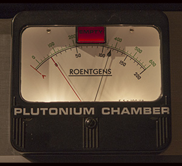
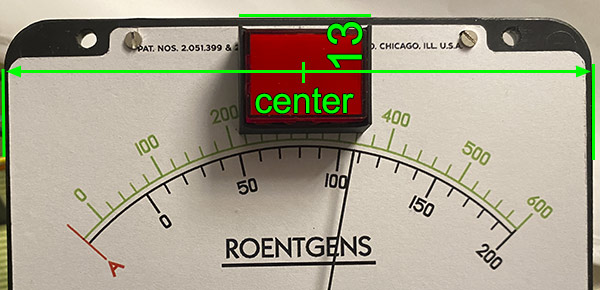

# The DIY Dash Gauges

This is a custom built prop; there is no complete kit available. 

CircuitSetup at this point only offers the [bezel](https://circuitsetup.us/product/delorean-time-machine-dash-plutonium-gauge-bezel/); production data for a Control Board which allows using a wide range of meters is in the ["electronics"](/DIY/electronics) folder. 

This prop was made to be compatible with the CircuitSetup line of movie props ([Time Circuits Display](https://tcd.out-a-ti.me), [Flux Capacitor](https://fc.out-a-ti.me), [SID](https://sid.out-a-ti.me)).

The Panel consists of several parts:
- A Control Board
- The gauges: In the picture above you see two Phaostron 631-15099 "Cyclic Trim" meters, and a Simpson model 49MC VU Meter disguised as the "Roentgens" gauge. Many other types of meters can be used.
- Aluminium (Aluminum) bezel; can be purchased at [CircuitSetup](https://circuitsetup.us/product/delorean-time-machine-dash-plutonium-gauge-bezel/). The measurements are in the ["enclosure"](/DIY/enclosure) folder of this repository. 

## Control board

|  |
|:--:| 
| *The Control Board* |

The Control board is mounted on the smaller gauges. Its features include
- 5V or 12V power supply
- audio, with speaker connector
- SD card slot
- a DAC for driving "analog" gauges with arbitrary voltages between 0 and 5V, and support for "digital" gauges (0/12V); room for user-mountable resistors to adjust board to very gauge type used
- "Legacy" connector with pins for 12V digital Roentgens gauge, 12V Roentgens backlight, 12V "Empty" LED,
- Time Travel button, plus an additional multi-purpose button ("Button 1"); Time Travel connector for external button
- Connector for two Door Switches, for Door-Sound play back.

### "Analog" vs. "Digital" gauges

The terms "analog" and "digital" have the following meaning in this document:

"Analog" gauges are ones that can show arbitrary values, ie move their pointers to arbitrary positions by using variable voltages. Best suited are voltmeters, ammeters or - for the Roentgens gauge: - VU-meters. Voltmeters can be usually driven with minimal voltages, even if their scale is far beyond that. It is mostly a matter of removing the meter's internal resistor(s), and putting suitable resistors on the Control Board. The Control Board can provide up to 5V and has room for two through-the-hole resistors per gauge. The firmware can easily be extended to define custom analog gauge types as regards their voltage range.

"Digital" gauges are ones that can only be controlled by power-on and power-off for "full" and "empty" pointer positions, respectively; this is useful if the gauge needs voltages beyond what the Control Board can provide (which is, as said, 5V), and is driven using external power and through a relay. Alternatively, one might also come up with the idea to create a gauge replica using a stepper motor and some logic to move the pointer to a fixed position on power-on, and move it back to the "Empty" position on power-loss, using a large capacitor to power the motor after power-loss.

### Control Board Hardware Configuration

In order to make the Control Board as versatile as possible, there are some solder jumpers (ie adjacent solder pads which are connected using solder), and easy-to-solder through-the-hole resistors which need to be added depending on the other hardware used.

|  |
|:--:| 
| *Click for hi-res image* |

Main connectors (red numbers):
- Red_1: 5V input for analog gauges and electronics
- Red_2: 12V input for electronics ("+"/"-" pins) and for digital gauges ("DG+"/"-" pins)
- Red_3: Time Travel button: To trigger a time travel, the button must connect "TT" to "3V3". Also used to connect the Dash Gauges to a TCD by wire.
- Red_4: Door switches: Switches need to connect "C" and "1" for door 1, and "C" and "2" for door 2.

Power supply:

The electronics can be run off 5V or 12V ("+"/"-" pins of connectors red_1 or red_2). If you are using analog gauges only, the choice is yours.

Digital gauges, as well as connecting anything to connector green_6, require 12V on the "DG+" pin of the 12V power connector [red_2]. If you want to power everything with 12V, connect the power supply to connector red_2 ("+"/"-" pins), and bridge the "+" and "DG+" pins with a short wire, as indicated by the arc printed on the board.

>For experts: To power the electronics with 5V, but the digital gauges with 12V, put 12V on "DG+" and "-" of the 12V connector red_2, and 5V on the 5V connector red_1 or on the ESP32 via USB.

Other connectors (green numbers):
- Green_1: Speaker for audio output
- Green_2: Backlight for Roentgens gauge
- Green_3: Analog Roentgens meter
- Green_4: Empty LED (for direct connection of white LED, forward voltage 3.3V)
- Green_5: Side switch for triggering empty/refill sequences
- Green_6: Digital Roentgens meter, 12V Roetgens backlight, 12V empty light

Hardware configuration for "analog" gauges (purple numbers):
- Left gauge ("Primary"):
  - Purple_3: Resistors R3, R4: Populate depending on gauge and supply voltage; see [here](#appendix-a-resistors-for-gauges).
  - Purple_4: Close ANA4 solder jumper; DIG4 (blue_4) must be open
  - Leave "DIG3" (blue_3) unconnected/open
- Center Gauge ("Percent Power"):
  - Purple_1: Resistors R1, R2: Populate depending on gauge and supply voltage; see [here](#appendix-a-resistors-for-gauges).
  - Purple_2: Close ANA2 solder jumper; DIG2 (blue_2) must be open
  - Leave "DIG1" (blue_1) unconnected/open
- "Roentgens" gauge, connected to "Analog Roentgens" connector [green_3]:
  - Purple_5: Resistors R5, R6: Populate depending on gauge and supply voltage; see [here](#appendix-a-resistors-for-gauges).
  - (DIG5 [blue_5]: Does not matter, has no influence on this connector)
 
Example for configuration for three analog gauges:

|  |
|:--:| 
| *Click for hi-res image* |

Configuration for digital gauges (blue numbers):
- Left gauge:
  - Blue_3: Bridge DIG3 by wire
  - Blue_4: Close DIG4 solder jumper (ANA4 [purple 4] must be open)
  - (R3, R4 [purple_3]: Leave unpopulated or remove)
- Center gauge:    
  - Blue_1: Bridge DIG1 by wire
  - Blue_2: Close DIG2 solder jumper; ANA2 (purple_2) must be open
  - (R1, R2: [purple_1]: Leave unpopulated or remove)
- Roentgens gauge (connected to "Digital Roentgens" connector [green 6]:
  - Blue_5: Bridge DIG5 by wire
  - (R5/R6 [purple 5]: Don't matter, have no influence on this connector)

Example for configuration for three digital gauges:

|  |
|:--:| 
| *Click for hi-res image* |

You can mix different types of analog and digital gauges; the firmware provides a type selection for each single gauge. In "full digital" configuration, as depticted above, the board can replace OEM ("legacy") boards from another manufacturer in order to make the otherwise "alien" Dash Gauges integrate with other CircuitSetup props.

Gauge illumination [yellow numbers]:

The gauges can be illuminated
- using "internal" power ("INT", always 5V), or
- using "external" power ("EXT"), fed through connector yellow_5.

Solder jumper yellow_4 selects whether INT or EXT is to be used; in case of EXT, connect your power supply to connector yellow_5.

INT is probably sufficient for most setups. The panel depicted above is running on INT with LEDs for the smaller gauges and 6V incandescent light bulbs for the Roentgens gauge. 

Legend:
- Yellow_1 (R7), yellow_2 (R8): Resistors for backlight LEDs of left and center gauge. The supply voltage is either 5V (INT), or whatever you connect to "Ext. Light Power" (yellow_5) (EXT). The resistor value depends on LED type and desired brightness. Example: 150R for yellow LEDs at 5V (INT). A calculator for the resistor value is [here](https://www.digikey.at/en/resources/conversion-calculators/conversion-calculator-led-series-resistor).
- Yellow_3 (R11): Resistor for Roentgens backlight on "Roentgens Light" connector [green 2]. In case of using incandescent light bulbs, just bridge this with a wire. The supply voltage is either 5V (INT), or whatever you connect to "Ext. Light Power" (yellow_5) (EXT).
- Yellow_4 ("Light Power"): Solder jumpers for selecting internal or external gauge illumination power: Connect either INT or EXT. For 5V lighting, close INT. To use external power (max. 12V), close EXT and connect the power supply to "Ext. Light Power" [yellow 5]. 
- Yellow_5 ("Ext. light power" connector): Connector for power supply for "EXT" setting.
- LED1, LED2: Backlight LEDs for left and center gauge. These are soldered to the back of the Control Board so they directly reach into the gauge's enclosure.

#### Connecting a Time Travel button

The Control Board has a Time Travel button (marked "TT"). If you want to connect an external Time Travel button, connect it to the "TT" and "3V3" pins of the "Time Travel" connector (red_3).

#### Connecting a TCD to the Dash Gauges by wire

If you want to connect a TCD to the Dash Gauges (for synchronized time travel sequences), wire as follows:

<table>
    <tr>
     <td align="center">Dash Gauges: "Time Travel" connector (red_3)</td>
     <td align="center">TCD with control board >=1.3</td>
     <td align="center">TCD with control board 1.2</td> 
    </tr>
   <tr>
     <td align="center">GND</td>
     <td align="center">GND of "Time Travel" connector</td>
     <td align="center">GND of "IO14" connector</td>
    </tr>
    <tr>
     <td align="center">TT</td>
     <td align="center">TT OUT of "Time Travel" connector</td>
     <td align="center">IO14 of "IO14" connector</td>
    </tr>
</table>

_Do not connect 3V3 to the TCD!_

## Gauges

### The "Primary" and "Percent Power" Gauges

In the Original, these were Phaostron 631 series meters. There are many different types/models of vintage Phaostron meters available; anything that starts with 63x fits size-wise; some older 300 series meters also fit. Not all 63x meters are usable though. I haven't seen a complete list, but what I came accross leads to some conclusions: 634 are wattmeters, which cannot be used. 639 are mainly AC ammeters for high amperages, to be avoided. Some meters have their zero position in the center of the scale, so avoid those, too. In my (limited) experience, the 631 series is the safest bet.

Tested meter options and configuration:

<table>
  <tr><td>Meter</td><td>Modification</td><td>R1/R2, R3/R4</td><td>Gauge type setting</td></tr>
  <tr><td>H&P <b>631-14672</b> 0-0.5V DC voltmeter</td><td>Pointer color changed from red to black using an Edding permanent marker</td><td>470R/8k2</td><td>H&P 631-14672</td></tr>
  <tr><td>Phaostron 0-5KV DC voltmeter (<b>300-07970</b>)</td><td>None</td><td>470R/4k7</td><td>Generic Analog (0-5V)</td></tr>
  <tr><td>Phaostron "Cyclic Trim" meter (<b>631-15099</b>)</td><td>The two resistors and the pot inside the meter need to be removed, and the wire (which lead to the pot) needs to be re-attached to the input terminal.</td><td>470R/4k7</td><td>Generic Analog (0-5V)</td></tr>
  <tr><td>Phaostron 0-75V DC voltmeter (<b>631-16471A</b>)</td><td>Internal resistor and caps need to be bridged.</td><td>470R/4k7</td><td>Generic Analog (0-5V)</td></tr>
</table>

Unusable:
- Phaostron 0-50/100/250/500A AC ammeter (**639-16341**).

It is hard to tell what a meter has inside and whether it's usable. Many meters have scales that don't match their actual input, and require an external "multiplier" (such as the 5KV voltmeter I tested). Avoid ammeters (Ampere meters) for currents >250mA, and AC voltmeters for high voltages (>50V); those often have stronger coils that cannot be used with low voltages. Otherwise, ammeters (especially if the scale is in the mA or uA range) can most likely be used after removing shunts, resistors or anything else that is between the two input terminals. 

To find out suitable resistor values for R1/R2 and/or R3/R4 on the Control Board, please see [here](#appendix-a-resistors-for-gauges).

Movie-accurate dials for those gauges are available in the [DIY/faces-labels](/DIY/faces-labels) folder. To apply them properly, cut them precisely at the bottom and the right hand side (leave some extra at the top and the left hand side; the template's top and left hand side lines account for that extra), then place the dial in the corner of a 90 deg angled ruler, and align the sticker at the bottom and right hand side. Slowly apply the sticker from the bottom up to avoid bubbles, and in the end, with the sticker facing down, use an Exacto knife to cut off the surplus.

For illumination, there are LEDs mounted on the back of the Control Board that reach into the enclosures of the gauges. These require a 6mm hole in the rear of the metal enclosure (center: 7mm from barrel bottom edge). I used a 5mm yellow LED (590nm). Most replicas use white LEDs, but I think on the A-Car as shown in the Petersen Museum, there are yellow ones used, and I found white ones too bright. 

Phaostron meters have either 6mm (1/4"-28 UNF) or 4mm (8-32 UNC) screw terminals on the back. For the 6mm versions, the LEDs can usually stick out approx 12-16mm from PCB to the LED's top, but you have to check your Phaostron meter for obstacles. For the shorter 4mm terminals the LED must be shorter. Look into your meter to find out about possible depth. The mounting order is meant to be original plastic washer, washer, nut, washer, Control Board, washer, nut.

### The "Roentgens" Gauge

The "Roentgens" gauge is more of a challenge. The original in the movie was a real Roentgens meter from a CP95 radiac. Such devices are hard to find, let alone one with the correct Simpson meter. The CP95 was built over a long period of time and they used meters from different manufacturers.

There are a lot of Simpson meters that look similar - yet not identical - to what was seen in the movies. However: One - quite important - issue is that hardly any Simpson meters are illuminated. Non-illuminated meters have a front that is 7mm thinner than the fronts of illuminated models, the glass is closer to the dial, and, as a result, the movie-accurate "Empty" light won't fit.

A word on Simpson model numbers: Their main model number means "case dimension", not "type of meter". "Model 49" therefore only means "4.5 inch case", but not whether this is a VU meter, a voltmeter, or what not:

They also re-used other codes (such as "SK 525-447") for a variety of meters, so that isn't an ID of a specific model either.

The only Simpson meters that came with illumination - apart from the Roentgens meters - were apparently their VU meters, models 49 (not listed above as they pre-date the catalog) and 142 (10470, 10540). Model 49 has the correct front dimensions - as long as its build date is something around the 1950s or earlier; later models, unfortunately using the same model number, look entirely different.

I was lucky to score a **Simpson model 49L VU-meter** with the movie-accurate front, and later a **Simpson model 49MC VU-meter**. They are illuminated through two 6V incandescent light bulbs. The additional red pointer was added by drilling a hole into the front (which should be in the center of the original pointer's turning circle), bending some steel spring wire (0.4mm) and attaching this wire with a screw.

The **model 142 VU-meters**, while perfectly usable electronically, are a bit smaller (4.25x3.9" vs 4.66x4.2") and look different on the back; their barrel is thicker (3.25" vs 2.78" in diameter), and the screws are not at the outer corners but closer to the barrel. There are special files in the [DIY/enclosure](/DIY/enclosure) folder for model 142 dimensions. Unfortunately, the barrel is so big that it does not allow for a simple hole for the "Empty" light; this must be done another way.

If you can't find a model 49 VU-meter or consider the 142 too far off, you could try a Simpson voltmeter. Models 29, 39, 49, 59 or 79 fit size-wise; ammeters in principle work but should be in a mA or uA range. Many meters are for voltages/currents beyond what the Control Board can deliver, but often they can be modified: For instance, the **Simpson model 49 0-50V DC voltmeter** has a 50K resistor inside; if this resistor is bridged, the meter shows full scale at 0.0375V. With a 5K6 resistor it shows full scale at approx 5V, which is perfectly usable. But again: You need to compromise on the "Empty" light, since non-illuminated Simpson meters are too thin.

Tested meter options and configuration:

<table>
  <tr><td>Meter</td><td>Modification</td><td>R5/R6</td><td>Gauge type setting</td></tr>
  <tr><td>Simpson models 49, 142 VU meters</td><td>None</td><td>330R/3k3</td><td>Standard VU-Meter</td></tr>
  <tr><td>Simpson model 49 0-50V DC voltmeter</td><td>Internal resistor needs to be bridged</td><td>0R/5k6</td><td>Generic Analog (0-5V)</td></tr>
  <tr><td>Simpson model 49 0-250mA DC ammeter</td><td>Internal coil resistor (looks like wire wrapped around paper) in the rear, close to the bottom, needs to be removed: No need to take the meter apart; just cut the two blank wires leading from the terminals towards the center, the coil resistor will fall out then (be sure to bend down the remaining stubs so that they don't touch anything), the other resistor can remain.</td><td>0R/1k0</td><td>Generic Analog (0-5V)</td></tr>
</table>

Unusable:
- Simpson model 49 voltmeter 0-250V AC

>How to take apart a Simpson meter: Those meters are very delicate. They have tiny sprial springs and other parts which need to be handled with care. To take a meter apart in order to access the "electronics" (resistors, caps, diodes, etc), unskrew the two nuts _on the bottom_ of the meter (usually 5.5mm), then carefully lift the meter's mechanics out of the case. Never unscrew anything on top of the mechanic! Before reassembly, check for washers or other metal parts the magnet might have attracted.

To find out suitable resistor values for R5/R6 on the Control Board, please see [here](#appendix-a-restistors-for-gauges).

When aligning the zero point to the "green zero" on the Roentgens scale, be careful when setting the "full percentage" of the meter: Above approx 90% the pointer might hit its end point and suffer damage.

Most Simpson meters have a drop-shaped pointer top which I was not able to remove (in fact, I didn't even try; I don't think the pointer top would have ended up properly straight); although I mounted the "Empty" light as high on the scale as possible, the pointer was still too long and collided with the light. My solution was to change the bends of the pointer where it leaves the driving mechanism more into an "S" shape, and I could thereby make it ever so short enough to pass the light. Another way would be to cut off the drop part, but that would make the pointer a tad too short in my opinion. _Warning_: Those pointers have a counter-weight on the opposite end and are perfectly balanced. If you decide to cut off the drop, the pointer is unbalanced and you need to cut off a tiny (!) bit of the other end, too, otherwise the pointer might not fully return to zero position and wander around if you tilt the gauge.

Regarding the "Empty" light: I used a light like this one (12V version), available from aliexpress and ebay:

There are also buttons that look identical and can be used instead:

A movie-accurate "Empty" label is in the [DIY/faces-labels](/DIY/faces-labels) folder.

The LED in those lights/buttons requires 12V. The Control Board has two connectors for the Empty LED:
- When using the "Empty Light" [green_4] connector, the light/button's built-in resistor needs to be removed: Pull up the red cover and pull out the LED; then desolder the LED (ie desolder the two metal tops, and push the LED out) and bridge the resistor, or replace it with a wire. Reassemble.
- When using the LED pins of the Digital Roetgens connector [6]: No modification of light/button needed, but the Control Board must be fed 12V on the "DG+" pin of the 12V connector [red_2].

Above light/button requires a 16mm hole. The vertical center of this hole is, looking at the meter from the front, at 12.5mm below the enclosure's edge, horizontally centered (relative to the enclosure, not the dial; the dial might be not accurately centered). In order to make the hole into the enclosure and the dial at exactly the same spot, drill the hole with the dial mounted. I used a step drill and drilled from the dial's side. Cover the meter's mechanism and have a vacuum ready, the Bakelite makes a lot of dirt (which could cause problems if it gets into the mechanism). If the steps on your step drill aren't high enough to go through the dial and the back of the enclosure, drill until the hole in the dial is of correct size (16mm), then remove the dial and finish drilling the enclosure. Do not attach your new dial label sticker before drilling, it's better to do this afterwards.

## Bezel

The bezel consists of three parts: The front and two side pieces. Measurements are in the [DIY/enclosure](/DIY/enclosure) folder of this repository.

You can purchase a bezel at [CircuitSetup](https://circuitsetup.us/product/delorean-time-machine-dash-plutonium-gauge-bezel/); note that it is for a model 49 panel meter ('Roentgens'); a model 142 won't fit.

# Appendix A: Resistors for Gauges

The goal of this procedure is to find resistor values that allow to drive the meter with a voltage of 0-5V.

What you need:
- A 5V power supply. If you plan on running the Dash Gauges with a 5V power supply, use that one for the following steps. 
- a set of axial resistors of different values in the range of 0-10k.

Is my meter an ammeter or a voltmeter? 

Often the scale/dial doean't say. You need to look inside: Ammeters have resistors, coils, shuts, etc that connect the input terminals _to each other_. Voltmeters only have parts between the input terminal and the coil.

For our purposes, however, the difference is unimportant. In order to make the meter work with the Dash Gauges Control Board, all built-in resistors, coils, capacitors, shuts, etc need to be removed. The input terminals need to be connected to the coil with nothing in between.

Now build your testing "circuit":

To find out suitable resistor values for R1/R2, R3/R4 or R5/R6, start out with a 10k resistor between the + output of the power supply and the + of the gauge (usually the left terminal when looking at the back).

Look at the needle when applying power:
- If the needle hits the right end point, remove power immediately and retry with a resistor with a _higher_ ohm value;
- If the needle stops on the way, before reaching the right end of the scale, retry with a resistor with a slightly _lower_ ohm value.

There is room for two resistors per gauge on the Control Board to allow combinations, for instance 3k3 + 330R to achieve 3k6. So you can try daisy-chaining two resistors if you don't find one that makes the needle go nicely close to the right end of the scale.

When you found (a) value(s) that make(s) the needle go exactly to the end point (or slightly below), that is what you put in 
- R1/R2 for the "Percent Power" gauge (center),
- R3/R4 for the "Primary" gauge (left),
- R5/F6 for the "Roentgens" gauge.

If a single resistor does the job, bridge the other position with a wire.

