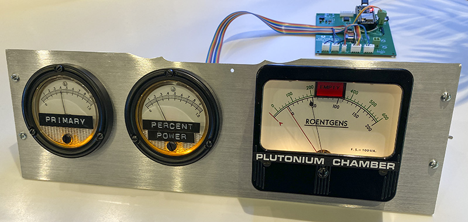
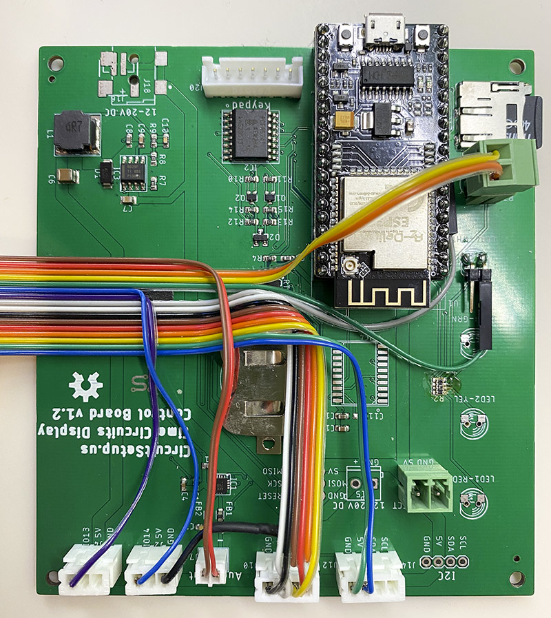
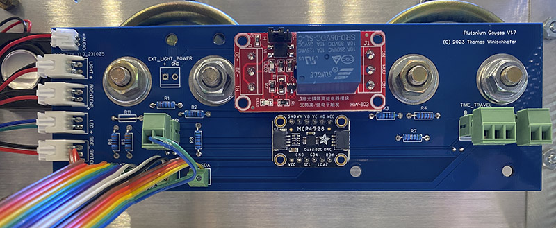
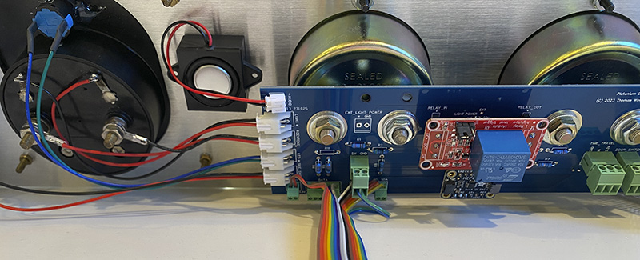
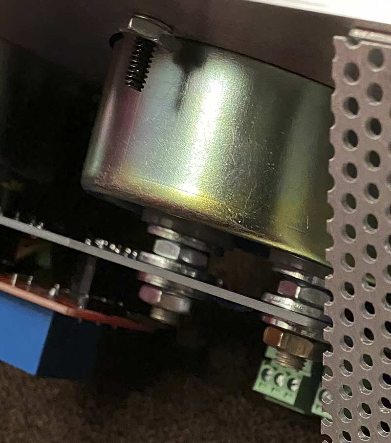
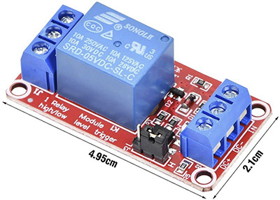

# The DIY Dash Gauges

Note that this is a custom built prop; there is no complete kit available. 

CircuitSetup at this point only offers the [bezel](https://circuitsetup.us/product/delorean-time-machine-dash-plutonium-gauge-bezel/); a Control Board which allows using a wide range of meters will be available soon. This prop was made to be compatible with the CircuitSetup line of movie props ([Time Circuits Display](https://tcd.out-a-ti.me), [Flux Capacitor](https://fc.out-a-ti.me), [SID](https://sid.out-a-ti.me)).

This manual is in transition; the new Control Board makes the Switch Board and abusing a TCD Control Board obsolete. Below information has not been fully updated for the new Control Board yet.

The Panel consists of several parts:
- Aluminum (Aluminium for non-Americans) enclosure; the measurements are in the ["enclosure"](/DIY/enclosure) folder of this repository. Can be bought at [CircuitSetup](https://circuitsetup.us/product/delorean-time-machine-dash-plutonium-gauge-bezel/) (does not fit model 142 gauge, see [here](#roentgens)).
- The gauges: The smaller gauges depicted are H&P 631-14672 (built by Phaostron) and the "Plutonium chamber" gauge is a Simpson 49L VU Meter, all driven by a MCP4728 quad-DAC. Movie-accurate faces for these gauges are in the ["faces-labels"](/DIY/faces-labels) folder of this repository.
- Upcoming shortly: An all-in-one Control Board mounted on the smaller gauges.

Until the Control Board is finished, and as visible in the pictures:
- A Switch Board, which is mounted on the smaller gauges' back side; it carries the interface for the gauges, the lights and switches, as well as some connectors for external switches/buttons. This Switch Board is easy to assemble, it only carries some resistors and connectors. The gerbers as well as an EasyEDA file are in the ["electronics"](/DIY/electronics) folder of this repository, JLCPCB can make this board for you. A BOM is available as well.
- A Control Board: In addition to the Switch Board, the heart of the device is a slightly modified TCD control board from [CircuitSetup](https://circuitsetup.us/product/time-circuits-display-control-board-with-keypad-trw-style-lenses/).

### Control board (upcoming new version)

The Control board is mounted on the smaller gauges. Its features include
- 5V or 12V power supply
- ESP32 dev board (NodeMCU ESP32S) socket
- audio, with speaker connector
- SD card slot
- a DAC for driving "analog" gauges with arbitrary voltage (0-5V), and support for "digital" gauges (0/12V); room for user-mountable resistors to adjust voltage to gauge type
- "Legacy" connector with pins for 12V digital Roentgens gauge, 12V Roentgens backlight, 12V "Empty" LED,
- Time Travel button, plus an additional multi-purpose button ("Button 1"); Time Travel connector for external button
- Connector for Door Switches

#### "Analog" (DAC-controlled) vs. "Digital" gauges

The terms "analog" and "digital" in connection with the Dash Gauges have the following meaning here:

"Analog" gauges are ones that can show arbitrary values, ie move their pointers to arbitrary positions by using variable voltages. Best suited are voltmeters or VU-meters, like the ones I used. Voltmeters can be usually driven with minimal voltages, even if their scale is far beyond that. It is mostly a matter of removing the meter's internal resistor, and putting suitable resistors on the Control Board. The DAC can provide up to 5V. The firmware can be extended to define custom analog gauge types as regards their voltage range.

"Digital" gauges are ones that can only be controlled by power-on and power-off for "full" and "empty" pointer positions, respectively; this is useful if the gauge needs voltages beyond what the Control Board can provide through the DAC (which is, as said, 5V), and is driven using external power and through a relay. One might also come up with the idea to create a gauge replica using a motor to move the pointer to a fixed position on power-on, and reset it to the "Empty" position on power-loss. Digital gauges are supplied with 12V by the Control board.

#### Noteworthy parts on Control Board:

- "Light Power": Solder jumpers for internal or external backlight power: Connect either INT and COM, or EXT and COM. For 5V lighting, close INT and COM. To use external power, connect the power supply to "Ext. Light Power", and close EXT and COM.
- Backlight LEDs for left and center gauge: These are soldered to the back of the Control Board so they directly stick into the gauge's enclosure. 
- R7, R8: Resistors for backlight LEDs of left and center gauge. The supply voltage is 5V (INT) or whatever you connect to "Ext. Light Power" (EXT). The resistor value depends on LED type and desired brightness (eg 150R for yellow LEDs at 5V).
- R11: Resistor for Roentgens backlight on "Roentgens Light" connector. If using lamps, just bridge. The supply voltage is 5V (INT) or whatever you connect to "Ext. Light Power" (EXT).

Hardware configuration for "analog" gauges:
- Left gauge:
  - R3, R4: Populate depending on gauge and supply voltage; for H&P 631-14672: 470R, 8k2
  - Close ANA4 solder jumper
- Center Gauge:
  - R1, R2: Populate depending on gauge and supply voltage; for H&P 631-14672: 470R, 8k2
  - Close ANA2 solder jumper
- "Roentgens" gauge (connected to "Analog Roentgens" connector):
  - R5, R6: Populate depending on gauge and supply voltage; for Simpson 49L VU meter total 3k6 (3k3+330R, for instance). Since VU-Meters are standardized, that resistor value should apply to VU meters in gneral.

Configuration for digital gauges (requires 12V power):
- Left gauge:
  - R3/R4: Leave unpopulated
  - Close DIG4 solder jumper
  - Bridge DIG3 by wire (or resistor, depending on gauge type)
- Center gauge:    
  - R1/R2: Leave unpopulated
  - Close DIG2 solder jumper
  - Bridge DIG1 by wire (or resistor, depending on gauge type)
- Roentgens gauge (connected to "Digital Roentgens" connector, pins 1 (+) and 2 (-)):
  - R5/R6: Leave unpopulated
  - Bridge LEG5 by wire (or resistor, depending on gauge type)

You can mix analog and digital gauges; the firmware provides a type selection for each single gauge.

### Control board (old version)

The control board is a modified TCD control board from CircuitSetup:

- The ENTER button is removed from the PCB and its pins serve as the "Side Switch".
- The white LED serves as the "Empty" LED in the "Roentgens" meter; it needs to desoldered.
- The other LEDS are removed from the PCB as they stick out and are not needed.
- The volume pot can be removed; this is, of course, optional, but since this board is assumingly hidden somewhere, the pot would be inaccessible anyway.
- The i2c, audio and IO connectors were relocated to the front side of the PCB (they are normally on the back)

As regards the cabling, two remarks:
- I used each 2 wires for GND and 5V (black/white, green/blue), since the wires I used are quite thin.
- I put each a wire of GND (brown, orange) between and beside the SDA/SCL wires to avoid crosstalk.

### Switch board

For the very gauges hardware I used, I designed a simple "switch board" which mounts on the smaller gauges. It carries the MCP4728 breakout board, a single channel relay board, all resistors for the gauges and LEDs, the LEDs for the smaller gauges and connectors for cables to the control board and to the "Roentgens" gauge. Also, it has connectors for an external Time Travel button and the door switches.

The Switch Board is mounted on the smaller gauges like this:

It carries this relay module for the lights (desolder the screw terminals, put in pin socket, pitch 5mm, 3 positions, for example Samtec HPF-03-01-T-S):

This module is not the most elegant solution but the easiest one if you, like me, are using real lamps instead of LEDs: also, it allows for an external power source for the lights.

The Switch Board also carries the Adafruit MCP4728 break-out board; just solder pin sockets to both lines of pads on the PCB (pitch 2.54mm, 6 positions, for example Samtec SSW-106-01-F-S).

Parts on Switch Board:
- R1, R2: Resistors for center gauge. Depend on gauge and supply voltage; for H&P 631-14672 470R, 8k2
- R3, R4: Resistors for left gauge. Depend on gauge and supply voltage; for H&P 631-14672 470R, 8k2
- R5, R6: Resistors for Roentgens gauge. Depend on gauge and supply voltage; for Simpson 49L VU meter total 3k6 (3k3+330R, for instance)
- R7, R8: Resistors for backlight LEDs of left and center gauge. Voltage is 5V, depends on LED type and desired brightness (eg 150R)
- R11: Resistor for Roentgens backlight. If using lamps, just bridge. Voltage is 5V.
- Backlight LEDs for left and center gauge: These are soldered to the back of the Switch Board so they directly stick into the gauge's enclosure. R7 and R8 should match the LEDs used
- Solder joint for internal or external backlight power: Connect either INT or EXT with COM.

Connectors on the Switch Board:
- Audio: This allows connecting the audio from the Control Board; the signal is directed to the top-left audio connector, where a speaker is to be attached.
- Data (from left to right):
  * 3_3V: 3.3V from the Control Board
  * SW: From the ENTER button of the Control Board
  * E-LED: From the white LED on the Control Board
  * IO14: From "IO14" on the Control Board
  * IO13: From "IO13" on the Control Board
  * IO27: From "IO27" on the Control Board
 
- 5V/GND: 5V and GND from the Control Board. There are two connectors for power on the Switch Board; you can choose which one suits you better.

- SCL/SDA: The i2c signal from he Control Board.

A connection diagram is [here](/DIY/electronics/connection%20diagram.png). Please note that when using a TCD Control Board version 1.3, the IO connectors are at different locations, but still carry their "IOxx" name in all cases on the PCB. IO13 is on the "Fake PWR" connector, IO14 and IO27 are on the "Time Travel" connector.

### Gauges

I used analog gauges only. 

*Important*: When using analog gauges in your project, do not connect the actual gauges until you selected the right hardware type in the Config Portal and have powered-down and powered-up the device once afterwards. This power-cycle is needed to reset the DAC's EEPROM to the correct settings and to avoid a power output too high at boot.

#### "Primary", "Percent Power"

For the smaller gauges I used two H&P 631-14672 (built by Phaostron), which are (were?) oddly available in volumes on ebay. The pointers on these are red, but an Edding permanent marker was quickly able to change them to black. These gauges have a scale from 0 to 0.5V, but can't cope with 0.5V, they need a resistor in series. I found 8k2 + 470R to be the best value (R1+R2, R3+R4).

Those two gauges are driven by channels A and B of the MCP4728. They show nearly identical readings at 10% and at 90%, in the middle they differ a bit, despite the voltage being identical. But since the idea here is not to actually measure voltage, that is still ok, the "full" percentage is configurable after all.

The movie-accurate dials of those gauges are available in the [DIY/faces-labels](/DIY/faces-labels) folder in this repository.

For the backlight, I drilled a hole in the rear of the metal enclosure, center bottom, and put a 5mm yellow LED (590nm) on the Switch Board (LED1, LED2, with suitable resistors (R7/R8; depending on LED, probably around 150R). Most replicas use white LEDs, but I think on the A-Car as shown in the Petersen Museum, there are yellow ones used, and I found white ones too bright. The LEDs are mounted on the board so that they stick out 12mm from PCB to the LED's top.

#### "Roentgens"

The big "Roentgens" gauge is more of a problem. The original in the movie was a real Roentgens meter from a CP95 radiac. Such devices are hard to find, let alone one with the correct Simpson meter. The CP95 was built over a long period of time and they used meters from different manufacturers.

Since I could not find a properly equipped CP95, I searched for an alternative ... and came across a lot of Simpson meters that looked good (while not identical). However: One - quite important - issue is that most Simpson meters are not illuminated. Because of this, their front is thinner, the glass is closer to the dial, and that is a problem because the movie-accurate "Empty" light won't fit.

A word on Simpson model numbers: Their main model number means "case style", not "type of meter". "Model 49" therefore only means "4.5 inch case", but not whether this is a VU meter, a voltmeter, or what not:

The only Simpson meters that came with illumination - apart from the Roentgens meters - were apparently their VU meters, models 49L ("L" for "light"; not listed above) and 142 (10470, 10540). Model 49L has the correct front dimensions; depending on their build date, they have either the three bands of "stripes" (like in the movie), or one thicker band of "stripes" in the center. (Later models, unfortunately using the same model number, look entirely different.)

I was lucky to score a **Simpson model 49L VU-meter** with the movie-accurate front, which is operated with a 3k6 resistor in series (R5+R6 on the Switch Board). Its lighting is through two 6V lamps (run at 5V) which need no resistor; R11 on the Switch Board is therefore bridged with a wire. If you prefer install LEDs, put a suitable resistor in place instead. The additional red pointer was added by drilling a hole into the front and putting a pointer from another meter inside. This red pointer is not moving, so it is reasonably easy to add.

The **model 142 VU-meters**, while perfectly usable electronically, are a bit smaller (4.25x3.9" vs 4.66x4.2") and look a bit different on the back; their barrel is thicker (3.25" vs 2.78" in diameter), and the screws are not at the outer corners but closer to the barrel. Unfortunately, the barrel is so big that it does not allow for a hole for the "Empty" light; this must be done another way. There are special files in the DIY/enclosure folder for model 142 dimensions.

If you can't find a VU-meter or consider the 142 too far off, you could try going with a Simpson voltmeter or ammeter (models 29, 39, 49, 59, or 79 fit size-wise). These meters mostly are for voltages/currents beyond what we have available directly, but: Most of those meters have built-in resistors that reduce the voltage for the coil to something far lower: For instance, the **Simpson model 49 voltmeter 0-50V DC (SK 525-447)** has a 50K resistor inside; if this resistor is bridged, the meter shows full scale at 0.0375V. With a 5K6 or so resistor is shows full scale at approx 5V, which is perfectly usable for our purposes. But again: You also need to compromise on the "Empty" light, since non-illuminated Simpson meters are too thin.

Speaking of the "Empty" light: I used a light like this one, available from aliexpress:

There are also buttons that look identical and can be used instead:

The LED in those lights/buttons is driven with 12V using a resistor; this resistor needs to be removed. No need to take out the blue part for this modification; just remove the red cover and pull out the LED; then desolder the LED and bridge the resistor.

Most Simpson meters have a drop-shaped pointer top which I was not able to remove (in fact, I didn't even try; I don't think the pointer top would have ended up properly straight); although I mounted the "Empty" light as high on the scale as possible, the pointer was still too long and collided with the light. My solution was to change the bends of the pointer where it leaves the driving mechanism more into an "S" shape, and I could thereby make it ever so short enough to pass the light. Another way would be to cut off the drop part, but that would make the pointer a tad too short in my opinion.

About the hole for the "Empty" light: Above light/button requires a 16mm hole. I started off drilling that hole into the dial. Then I mounted the dial into the meter and marked the hole on the plastic enclosure with a pencil. The next step was to remove the dial again, wrap the mechanism in plastic to keep dust out, and drill a smaller hole (7mm) into the enclosure. Then I milled that hole into a bigger one, until the button fit. The plastic of the enclosure is quite brittle and breaks easily. Drilling a 16mm hole appeared too risky. Hence the drill/mill method.

### Enclosure

The enclosure consists of three parts: The front and two side pieces. Measurements are in the [DIY/enclosure](/DIY/enclosure) folder of this repository.

You can buy an enclosure at [CircuitSetup](https://circuitsetup.us/product/delorean-time-machine-dash-plutonium-gauge-bezel/); note that it is for a model 49 panel meter ('Roentgens'); a model 142 won't fit.

### Connecting a Time Travel button

The Control Board has a Time Travel button (marked "TT"). If you want to connect an external Time Travel button, connect it to the "TT" and "3V3" pins of the "Time Travel" connector.

### Adapting the firmware to your gauges

The MCP4728 can deliver up to 5V. Since your gauges probably will not cover exactly this voltage spread, the firmware can be adapted to limit the maximum voltage put out. This is done in dg_main.c, and there are some examples listed there. You can, of course, contact me if you need assistance with the firmware. *In fact, I would like to know about your hardware and include your specific type to the list, so that you don't have to patch stuff on firmware updates.*

### Connecting a TCD to the Dash Gauges by wire

If you want to connect a TCD to the Dash Gauges by wire (such as mentioned [here](https://github.com/realA10001986/Dash-Gauges/tree/main#connecting-a-tcd-by-wire)), wire as follows:

<table>
    <tr>
     <td align="center">Dash Gauges</td>
     <td align="center">TCD with control board 1.2</td>
     <td align="center">TCD with control board 1.3</td>
    </tr>
   <tr>
     <td align="center">GND of "Time Travel" connector</td>
     <td align="center">GND of "IO14" connector</td>
     <td align="center">GND on "Time Travel" connector</td>
    </tr>
    <tr>
     <td align="center">TT of "Time Travel" connector</td>
     <td align="center">IO14 of "IO14" connector</td>
     <td align="center">TT OUT on "Time Travel" connector</td>
    </tr>
</table>

