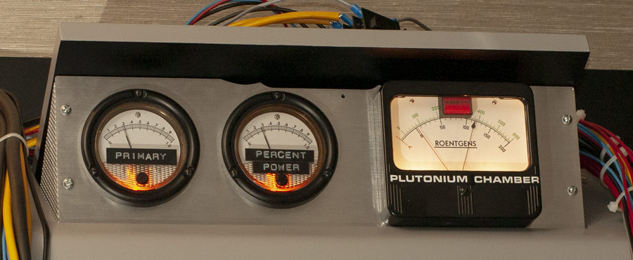
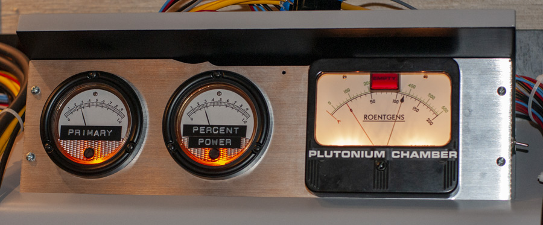
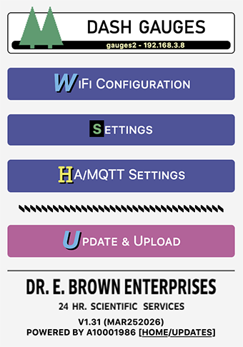
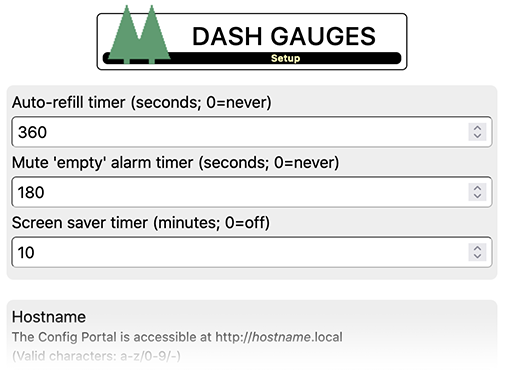

# Dash Gauges (Delorean Time Machine)

This [repository](https://dg.out-a-ti.me) holds 
- [instructions](Hardware.md) for building a Dash Gauge panel, as seen in the Delorean Time Machine,
- and a suitable firmware.

This panel is meant as an add-on for the CircuitSetup [Time Circuits Display](https://tcd.out-a-ti.me) as it relies on the TCD's keypad to control many of its functions.

|  |
|:--:|
| Click to watch the video |

For information on the hardware, please see [here](Hardware.md).

Firmware features include
- support for analog gauges (with software-controlled arbitrary pointer position) and digital gauges (Empty/Full, without arbitrary pointer position)
- selectable "full" percentages per analog gauge (besides for fun, useful for adjusting inaccurate readings)
- selectable threshold percentage for Empty/Full position for digital gauges
- [Time Travel](#time-travel) function, triggered by button, [Time Circuits Display](https://tcd.out-a-ti.me) (TCD) or via [MQTT](#home-assistant--mqtt)
- support for Side Switch to play "empty" and "refill" sequences
- Automatic refill timer, automatic alarm mute timer (both optional)
- support for door switches for playing sounds when opening/closing the car doors
- [wireless communication](#bttf-network-bttfn) with [Time Circuits Display](https://tcd.out-a-ti.me); used for synchronized time travels, alarm, night mode, fake power and remote control through TCD keypad
- [music player](#the-music-player): Play mp3 files located on an SD card [requires TCD connected wirelessly for control]
- [SD card](#sd-card) support for custom audio files for effects, and music for the Music Player
- advanced network-accessible [Config Portal](#the-config-portal) for setup (http://gauges.local, hostname configurable)
- [Home Assistant](#home-assistant--mqtt) (MQTT 3.1.1) support
- built-in OTA installer for firmware updates and audio files

## Firmware Installation

If a previous version of the Dash Gauges firmware is installed on your device's ESP32, you can update easily using the pre-compiled binary. Enter the [Config Portal](#the-config-portal), click on "Update" and select the pre-compiled binary file provided in this repository ([install/dashgauges-A10001986.ino.nodemcu-32s.bin](https://github.com/realA10001986/Dash-Gauges/blob/main/install/dashgauges-A10001986.ino.nodemcu-32s.bin)).

If you are using a fresh ESP32 board, please see [dashgauges-A10001986.ino](https://github.com/realA10001986/Dash-Gauges/blob/main/dashgauges-A10001986/dashgauges-A10001986.ino) for detailed build and upload information, or, if you don't want to deal with source code, compilers and all that nerd stuff, go [here](https://install.out-a-ti.me) and follow the instructions.

 *Important: After a firmware update, the "empty" LED might blink for short while after reboot. Do NOT unplug the device during this time.*

### Audio data installation

The firmware comes with audio data ("sound-pack") which needs to be installed separately. The audio data is not updated as often as the firmware itself. If you have previously installed the latest version of the sound-pack, you normally don't have to re-install the audio data when you update the firmware. Only if either a new version of the sound-pack is released, or your device is quiet after a firmware update, a re-installation is needed.

The first step is to download "install/sound-pack-xxxxxxxx.zip" and extract it. It contains one file named "DGA.bin".

Then there are two alternative ways to proceed. Note that both methods *require an SD card*.

1) Through the [Config Portal](#the-config-portal). Click on *Update*, select the "DGA.bin" file in the bottom file selector and click on *Upload*. Note that an SD card must be present during this operation.

2) Via SD card:
- Copy "DGA.bin" to the root directory of of a FAT32 formatted SD card;
- power down the Dash Gauges,
- insert this SD card into the slot and 
- power up the Dash Gauges; the audio data will be installed automatically.

After installation, the SD card can be re-used for [other purposes](#sd-card).

## Initial Configuration

>The following instructions only need to be followed once, on fresh Dash Gauges. They do not need to be repeated after a firmware update.

The first step is to establish access to the configuration web site ("Config Portal") in order to configure your Dash Gauges:

- Power up the device and wait until the startup sequence has completed.
- Connect your computer or handheld device to the WiFi network "DG-AP".
- Navigate your browser to http://gauges.local or http://192.168.4.1 to enter the Config Portal.

#### Connecting to a WiFi network

As long as the device is unconfigured, it creates a WiFi network of its own named "DG-AP". This is called "Access point mode", or "AP-mode". 

It is ok to leave the Dash Gauges in this mode, especially if it run stand-alone. In a typical home setup and/or if you also have a [Time Circuits Display](https://tcd.out-a-ti.me), however, you might want to connect the Dash Gauges to a WiFi network (in case of using it together with a TCD: to the same WiFi network the TCD is connected to). If you have your Dash Gauges, along with a Time Circuits Display, mounted in a car, you might want to connect the Dash Gauges to the TCD's very own WiFi network "TCD-AP"; see [here](#car-setup).

In order to connect your Dash Gauges to a WiFi network, click on "Configure WiFi". The bare minimum is to select an SSID (WiFi network name) and a WiFi password.

>Note that the device requests an IP address via DHCP, unless you entered valid data in the fields for static IP addresses (IP, gateway, netmask, DNS). If the device is inaccessible as a result of incorrect static IPs, 
>- power-down the device,
>- hold the Time Travel button,
>- power-up the device (while still holding the Time Travel button)
>- wait until the "Empty" LED flashes briefly,
>- flip the Side Switch twice within 10 seconds,
>- wait until the "Empty" LED lights up,
>- then release the Time Travel button.
>
>This procedure causes static IP data to be deleted; the device will return to DHCP after a reboot.

After saving the WiFi network settings, the device reboots and tries to connect to your configured WiFi network. If that fails, it will again start in access point mode.

After completing this step, your Dash Gauges are ready to be configured through the "Config Portal".

## The Config Portal

The "Config Portal" is the Dash Gauges' configuration web site.

|  |
|:--:| 
| *The Config Portal's main page* |

It can be accessed as follows:

#### If Dash Gauges are in AP mode

- Connect your computer or handheld device to the WiFi network "DG-AP".
- Navigate your browser to http://gauges.local or http://192.168.4.1 to enter the Config Portal.

#### If Dash Gauges are connected to WiFi network

- Connect your hand-held/computer to the same WiFi network to which the Dash Gauges are connected, and
- navigate your browser to http://gauges.local

  Accessing the Config Portal through this address requires the operating system of your hand-held/computer to support Bonjour/mDNS: Windows 10 version TH2     (1511) [other sources say 1703] and later, Android 13 and later; MacOS and iOS since the dawn of time.

  If connecting to http://gauges.local fails due to a name resolution error, you need to find out the Gauges' IP address. In order to do so, hold "Button 1" on the Control Board for 2 seconds, and listen. The IP address will be spoken out loud. Then, on your handheld or computer, navigate to http://a.b.c.d (a.b.c.d being the IP address as just given by the Dash Gauges) in order to enter the Config Portal.

In the main menu, click on "Setup" to configure your Dash Gauges. 

|  |
|:--:| 
| *Click for full screenshot* |

A full reference of the Config Portal is [here](#appendix-a-the-config-portal).

## Gauge Hardware Configuration

The firmware needs to know the type of gauges installed; by default, power output to the gauges is disabled.

In order to configure the Dash Gauges for your specific hardware,
- hold the "Time Travel" button for 5 seconds (until a beep is emitted),
- then enter the Config Portal as described above, and click on "Setup".

Near the bottom of this page, there are three drop-down widgets, one for each gauge. Carefully select the type for each of your gauges, and click on "Save".

After this step, your Dash Gauges are ready to be used.

## Basic Operation

As mentioned, the Dash Gauges are an add-on for a Time Circuits Display. Their basic function is to show some values on its gauges, and to play an "empty" alarm after a time travel.

There is little to play with when the Dash Gauges aren't connected to a TCD:
- To quickly trigger the "empty" sequence, flip the side switch of your Dash Gauges. To "refill", flip that switch again.
- Press the time travel button to trigger a simple "surge" sequence.

The Dash Gauges are way more fun when other props (TCD, FC, SID) are present as well. The TCD is of special importance: When connected through BTTFN, the TCD can act as a remote control for the Dash Gauges.

## TCD remote command reference

### Remote control reference

<table>
    <tr>
     <td align="center" colspan="2">Special sequences (&#9166; = ENTER key)</td>
    </tr>
   <tr><td>Function</td><td>Code on TCD</td></tr>
    <tr>
     <td align="left">"Refill"</td>
     <td>009&#9166;</td>
    </tr>
   <tr>
     <td align="left">Set "full" percentage of "Primary" gauge (01-99%)</td>
     <td>9101&#9166; - 9199&#9166;</td>
    </tr>
    <tr>
     <td align="left">Reset "full" percentage of "Primary" gauge</td>
     <td align="left">9100&#9166;</td>
    </tr>
    <tr>
     <td align="left">Set "full" percentage of "Percent Power" gauge (01-99%)</td>
     <td align="left">9401&#9166; - 9499&#9166;</td>
    </tr>
    <tr>
     <td align="left">Reset "full" percentage of "Percent Power" gauge</td>
     <td align="left">9400&#9166;</td>
    </tr>
    <tr>
     <td align="left">Set "full" percentage of "Roentgens" gauge (01-99%)</td>
     <td align="left">9701&#9166; - 9799&#9166;</td>
    </tr>
    <tr>
     <td align="left">Reset "full" percentage of "Roentgens" gauge</td>
     <td align="left">9700&#9166;</td>
    </tr>    
    <tr>
     <td align="left">Set volume level (00-19)</td>
     <td align="left">9300&#9166; - 9319&#9166;</td>
    </tr>
    <tr>
     <td align="left"><a href="#the-music-player">Music Player</a>: Play/Stop</td>
     <td align="left">9005&#9166;</td>
    </tr>
    <tr>
     <td align="left"><a href="#the-music-player">Music Player</a>: Previous song</td>
     <td align="left">9002&#9166;</td>
    </tr>
    <tr>
     <td align="left"><a href="#the-music-player">Music Player</a>: Next song</td>
     <td align="left">9008&#9166;</td>
    </tr>
    <tr>
     <td align="left"><a href="#the-music-player">Music Player</a>: Select music folder (0-9)</td>
     <td align="left">9050&#9166; - 9059&#9166;</td>
    </tr>
    <tr>
     <td align="left"><a href="#the-music-player">Music Player</a>: Shuffle off</td>
     <td align="left">9222&#9166;</td>
    </tr>
    <tr>
     <td align="left"><a href="#the-music-player">Music Player</a>: Shuffle on</td>
     <td align="left">9555&#9166;</td>
    </tr> 
    <tr>
     <td align="left"><a href="#the-music-player">Music Player</a>: Go to song 0</td>
     <td align="left">9888&#9166;</td>
    </tr>
    <tr>
     <td align="left"><a href="#the-music-player">Music Player</a>: Go to song xxx</td>
     <td align="left">9888xxx&#9166;</td>
    </tr>
    <tr>
     <td align="left">Play "<a href="#additional-custom-sounds">key1.mp3</a>"</td>
     <td align="left">9001&#9166;</td>
    </tr>
    <tr>
     <td align="left">Play "<a href="#additional-custom-sounds">key3.mp3</a>"</td>
     <td align="left">9003&#9166;</td>
    </tr>
    <tr>
     <td align="left">Play "<a href="#additional-custom-sounds">key4.mp3</a>"</td>
     <td align="left">9004&#9166;</td>
    </tr>
    <tr>
     <td align="left">Play "<a href="#additional-custom-sounds">key6.mp3</a>"</td>
     <td align="left">9006&#9166;</td>
    </tr>
    <tr>
     <td align="left">Play "<a href="#additional-custom-sounds">key7.mp3</a>"</td>
     <td align="left">9007&#9166;</td>
    </tr>
    <tr>
     <td align="left">Play "<a href="#additional-custom-sounds">key9.mp3</a>"</td>
     <td align="left">9009&#9166;</td>
    </tr>
    <tr>
     <td align="left">Say current IP address</td>
     <td align="left">9090&#9166;</td>
    </tr>   
    <tr>
     <td align="left">Reboot the device</td>
     <td align="left">9064738&#9166;</td>
    </tr>
    <tr>
     <td align="left">Delete static IP address and WiFi-AP password</td>
     <td align="left">9123456&#9166;</td>
    </tr>
    <tr>
     <td align="left">Unlock "gauge type" selection in Config Portal</td>
     <td align="left">9317931&#9166;</td>
    </tr>
</table>

[Here](https://github.com/realA10001986/Dash-Gauges/blob/main/CheatSheet.pdf) is a cheat sheet for printing or screen-use. (Note that MacOS' preview application has a bug that scrambles the links in the document. Acrobat Reader does it correctly.)

## Time travel

To trigger a "time travel" stand-alone, you need to install a "Time Travel" button. Pressing that button briefly will let the Dash Gauges play their time travel sequence. Please see [here](hardware/#connecting-a-time-travel-button) for how to wire that button.

Other ways of triggering a time travel are available if a [Time Circuits Display](#connecting-a-time-circuits-display) is connected.

## SD card

Preface note on SD cards: For unknown reasons, some SD cards simply do not work with this device. For instance, I had no luck with Sandisk Ultra 32GB and  "Intenso" cards. If your SD card is not recognized, check if it is formatted in FAT32 format (not exFAT!). Also, the size must not exceed 32GB (as larger cards cannot be formatted with FAT32). Transcend SDHC cards work fine in my experience.

The SD card, apart from being required for [installing](#audio-data-installation) of the built-in audio data, can be used for substituting built-in sound effects and for music played back by the [Music player](#the-music-player). Also, it is _strongly recommended_ to store [secondary settings](#-save-secondary-settings-on-sd) on the SD card to minimize [Flash Wear](#flash-wear).

Note that the SD card must be inserted before powering up the device. It is not recognized if inserted while the Dash Gauges are running. Furthermore, do not remove the SD card while the device is powered.

### Sound substitution

The Dash Gauges' built-in sound effects can be substituted by your own sound files on a FAT32-formatted SD card. These files will be played back directly from the SD card during operation, so the SD card has to remain in the slot.

Your replacements need to be put in the root (top-most) directory of the SD card, be in mp3 format (128kbps max) and named as follows:
- "startup.mp3". Played when the Dash Gauges are connected to power and finished booting;
- "refill.mp3". Played during the "refill"-sequence;
- "alarm.mp3". Played when the alarm sounds (triggered by a Time Circuits Display via BTTFN or MQTT);
- "0.mp3" through "9.mp3", "dot.mp3": Numbers for IP address read-out.
- "dooropen.mp3"/"doorclose.mp3": Played when the state of the door switch changes.

### Additional Custom Sounds

The firmware supports some additional user-provided sound effects, which it will load from the SD card. If the respective file is present, it will be used. If that file is absent, no sound will be played.

- "key1.mp3", "key3.mp3", "key4.mp3", "key6.mp3", "key7.mp3", "key9.mp3": Will be played when you type 900x (x being 1, 3, 4, 6, 7 or 9) on the TCD (connected through BTTFN).

> The seemingly odd numbering is because of synchronicity with other props, especially the TCD and its keymap where the MusicPlayer occupies keys 2, 5, 8.

Those files are not provided here. You can use any mp3, with a bitrate of 128kpbs or less.

### Installing Custom & Replacement Audio Files

As of version 1.20 of the Dash Gauges firmware, above mentioned audio files (both replacements and custom sounds) can either be copied to the SD card using a computer, or uploaded through the Config Portal.

Uploading through the Config Portal works exactly like [installing the default audio files](#audio-data-installation); on the main menu, click "UPDATE". Afterwards choose the file to upload in the bottom file selector, and click "UPLOAD". The firmware recognizes mp3 files, and stores them on the SD card. (Unlike with the default files, no further "installation" takes place.)

In order to delete a file from the SD card, upload a file whose names is prefixed with "delete-". For example: To delete "key1.mp3" from the SD card, either rename your "key1.mp3" into "delete-key1.mp3", or create a new file named "delete-key1.mp3", and upload this file. The firmware detects the "delete-" part and, instead of storing the uploaded file, it throws it away and deletes "key1.mp3" from the SD card.

For technical reasons, the Dash Gauges must reboot after a file is uploaded in this way.

Please remember that the maximum bitrate for mp3 files is 128kbps. Also note that the uploaded file is stored to the root folder of the SD card, so this way of uploading cannot be used to upload songs for the Music Player. 

## The Music Player

The firmware contains a simple music player to play mp3 files located on the SD card. This player requires a TCD connected through BTTFN for control.

In order to be recognized, your mp3 files need to be organized in music folders named *music0* through *music9*. The folder number is 0 by default, ie the player starts searching for music in folder *music0*. This folder number can be changed in the Config Portal or through the TCD keypad (905x).

The names of the audio files must only consist of three-digit numbers, starting at 000.mp3, in consecutive order. No numbers should be left out. Each folder can hold up to 1000 files (000.mp3-999.mp3). *The maximum bitrate is 128kpbs.*

Since manually renaming mp3 files is somewhat cumbersome, the firmware can do this for you - provided you can live with the files being sorted in alphabetical order: Just copy your files with their original filenames to the music folder; upon boot or upon selecting a folder containing such files, they will be renamed following the 3-digit name scheme (as mentioned: in alphabetic order). You can also add files to a music folder later, they will be renamed properly; when you do so, delete the file "TCD_DONE.TXT" from the music folder on the SD card so that the firmware knows that something has changed. The renaming process can take a while (10 minutes for 1000 files in bad cases). Mac users are advised to delete the ._ files from the SD before putting it back into the control board as this speeds up the process.

To start and stop music playback, enter 9005 followed by ENTER on your TCD. Entering 9002 jumps to the previous song, 9008 to the next one.

By default, the songs are played in order, starting at 000.mp3, followed by 001.mp3 and so on. By entering 9555 on the TCD, you can switch to shuffle mode, in which the songs are played in random order. Type 9222 followed by ENTER to switch back to consecutive mode.

Entering 9888 followed by OK re-starts the player at song 000, and 9888xxx (xxx = three-digit number) jumps to song #xxx.

See [here](#remote-control-reference) for a list of controls of the music player.

While the music player is playing music, other sound effects are disabled/muted. Initiating a time travel stops the music player. The TCD-triggered alarm will, if so configured, sound and stop the music player.

## Connecting a Time Circuits Display

### BTTF-Network ("BTTFN")

The TCD can communicate with the Dash Gauges wirelessly, via the built-in "**B**asic-**T**elematics-**T**ransmission-**F**ramework" over WiFi. It can send out information about a time travel and an alarm. Furthermore, the TCD's keypad can be used to remote-control the Dash Gauges.

|  |
|:--:|
| Click to watch the video |

Note that the TCD's firmware must be up to date for BTTFN. You can use [this](http://tcd.out-a-ti.me) one or CircuitSetup's release 2.9 or later.

In order to connect your Dash Gauges to the TCD using BTTFN, just enter the TCD's IP address or hostname in the **_IP address or hostname of TCD_** field in the Dash Gauges's Config Portal. On the TCD, no special configuration is required.
  
Afterwards, the Dash Gauges and the TCD can communicate wirelessly and 
- play time travel sequences in sync,
- both play an alarm-sequence when the TCD's alarm occurs,
- the Dash Gauges can be remote controlled through the TCD's keypad (command codes 9xxx),
- the Dash Gauges queries the TCD for fake power and night mode, in order to react accordingly if so configured,
- pressing the dash gauges' Time Travel button can trigger a synchronized Time Travel on all BTTFN-connected devices, just like if that Time Travel was triggered through the TCD.

You can use BTTF-Network and MQTT at the same time, see [below](#home-assistant--mqtt).

### Connecting a TCD by wire

>Note that a wired connection only allows for synchronized time travel sequences, no other communication takes place, and there is no way to remote-control the Gauges through the TCD by wire. A wireless connection over BTTFN/WiFi is much more powerful and therefore recommended over a wired connection.

For wiring information, please see [here](hardware/#connecting-a-tcd-to-the-dash-gauges-by-wire).

With the wiring in place, head to the Config Portal and set the option **_TCD connected by wire_**. On the TCD, the option "Control props connected by wire" must be set.

>You can connect both the TCD and a Time Travel button to the Dash Gauges. But the button should not be pressed when the option **_TCD connected by wire_** is set, as it might yield unwanted results.

## Home Assistant / MQTT

The Dash Gauges support the MQTT protocol version 3.1.1 for the following features:

### Control the Dash Gauges via MQTT

The Dash Gauges can - to some extent - be controlled through messages sent to topic **bttf/dg/cmd**. Support commands are
- TIMETRAVEL: Start a [time travel](#time-travel)
- EMPTY: "Drain" Plutonium and trigger alarm
- REFILL: Refill the Plutonium chamber
- PLAY_DOOR_OPEN, PLAY_DOOR_CLOSED: Play respective door sounds; these commands are only executed if the option **_Play door sounds_** in the Config Portal is unchecked.
- MP_PLAY: Starts the [Music Player](#the-music-player)
- MP_STOP: Stops the [Music Player](#the-music-player)
- MP_NEXT: Jump to next song
- MP_PREV: Jump to previous song
- MP_SHUFFLE_ON: Enables shuffle mode in [Music Player](#the-music-player)
- MP_SHUFFLE_OFF: Disables shuffle mode in [Music Player](#the-music-player)
- MP_FOLDER_x: x being 0-9, set Music Folder number for [Music Player](#the-music-player)

### Receive commands from Time Circuits Display

If both TCD and Dash Gauges are connected to the same broker, and the option **_Send event notifications_** is checked on the TCD's side, the Dash Gauges will receive information on time travel and alarm and play their sequences in sync with the TCD. Unlike BTTFN, however, no other communication takes place.

MQTT and BTTFN can co-exist. However, the TCD only sends out time travel and alarm notifications through either MQTT or BTTFN, never both. If you have other MQTT-aware devices listening to the TCD's public topic (bttf/tcd/pub) in order to react to time travel or alarm messages, use MQTT (ie check **_Send event notifications_**). If only BTTFN-aware devices are to be used, uncheck this option to use BTTFN as it has less latency.

### Setup

In order to connect to a MQTT network, a "broker" (such as [mosquitto](https://mosquitto.org/), [EMQ X](https://www.emqx.io/), [Cassandana](https://github.com/mtsoleimani/cassandana), [RabbitMQ](https://www.rabbitmq.com/), [Ejjaberd](https://www.ejabberd.im/), [HiveMQ](https://www.hivemq.com/) to name a few) must be present in your network, and its address needs to be configured in the Config Portal. The broker can be specified either by domain or IP (IP preferred, spares us a DNS call). The default port is 1883. If a different port is to be used, append a ":" followed by the port number to the domain/IP, such as "192.168.1.5:1884". 

If your broker does not allow anonymous logins, a username and password can be specified.

Limitations: MQTT Protocol version 3.1.1; TLS/SSL not supported; ".local" domains (MDNS) not supported; server/broker must respond to PING (ICMP) echo requests. For proper operation with low latency, it is recommended that the broker is on your local network. 

## Car setup

If your Dash Gauges, along with a [Time Circuits Display](https://tcd.out-a-ti.me/), is mounted in a car, the following network configuration is recommended:

#### TCD

- Run your TCD in [*car mode*](https://tcd.out-a-ti.me/#car-mode);
- disable WiFi power-saving on the TCD by setting **_WiFi power save timer (AP-mode)_** to 0 (zero).

#### Dash Gauges

Enter the Config Portal on the Dash Gauges (as described above), click on *Setup* and
  - enter *192.168.4.1* into the field **_IP address or hostname of TCD_**
  - check the option **_Follow TCD fake power_** if you have a fake power switch for the TCD (like eg a TFC switch)
  - click on *Save*.

After the Dash Gauges have restarted, re-enter the Dash Gauges's Config Portal (while the TCD is powered and in *car mode*) and
  - click on *Configure WiFi*,
  - select the TCD's access point name in the list at the top or enter *TCD-AP* into the *SSID* field; if you password-protected your TCD's AP, enter this password in the *password* field. Leave all other fields empty,
  - click on *Save*.

Using this setup enables the Dash Gauges to receive notifications about time travel and alarm wirelessly, and to query the TCD for data. Also, the TCD keypad can be used to remote-control the Dash Gauges.

In order to access the Dash Gauges's Config Portal in your car, connect your hand held or computer to the TCD's WiFi access point ("TCD-AP"), and direct your browser to http://gauges.local ; if that does not work, go to the TCD's keypad menu, press ENTER until "BTTFN CLIENTS" is shown, hold ENTER, and look for the Dash Gauges's IP address there; then direct your browser to that IP by using the URL http://a.b.c.d (a-d being the IP address displayed on the TCD display).

### Door Switches

The Dash Gauges have a connector for two door switches. These switches trigger door open/close sounds.

By default, the "Door Open" sound is played when the switch is closed; "Door close" is played when the switch opens.

In the Config Portal, you can invert this setting, so that the "Door Open" sound is played when the switch is closed.

## Flash Wear

Flash memory has a somewhat limited life-time. It can be written to only between 10.000 and 100.000 times before becoming unreliable. The firmware writes to the internal flash memory when saving settings and other data. Every time you change settings, data is written to flash memory.

In order to reduce the number of write operations and thereby prolong the life of your Dash Gauges, it is recommended to use a good-quality SD card and to check **_[Save secondary settings on SD](#-save-secondary-settings-on-sd)_** in the Config Portal; secondary settings (eg current volume) are then stored on the SD card (which also suffers from wear but is easy to replace). See [here](#-save-secondary-settings-on-sd) for more information.

## Appendix A: The Config Portal

### Main page

##### &#9654; Configure WiFi

Clicking this leads to the WiFi configuration page. On that page, you can connect your Dash Gauges to your WiFi network by selecting/entering the SSID (WiFi network name) as well as a password (WPA2). By default, the Dash Gauges request an IP address via DHCP. However, you can also configure a static IP by entering the IP, netmask, gateway and DNS server. All four fields must be filled for a valid static IP configuration. If you want to stick to DHCP, leave those four fields empty.

Note that this page has nothing to do with Access Point mode; it is strictly for connecting your Dash Gauges to an existing WiFi network as a client.

##### &#9654; Setup

This leads to the [Setup page](#setup-page).

##### &#9654; Update

This leads to the firmware and audio update page. 

In order to upload a new firmware binary (such as the ones published here in the install/ folder), select that image file in the top file selector and click "Update".

You can also install the Dash Gauges' audio data on this page; download the current sound-pack, extract it and select the resulting DGA.bin file in the bottom file selector. Finally, click "Upload". Note that an SD card is required for this operation.

Note that either a firmware or audio data can be uploaded at once, not both at the same time.

##### &#9654; Erase WiFi Config

Clicking this (and saying "yes" in the confirmation dialog) erases the WiFi configuration (WiFi network and password) and reboots the device; it will restart in "access point" mode. See [here](#short-summary-of-first-steps).

---

### Setup page

#### Basic settings

##### &#9654; Auto-refill timer

After a time travel, the plutonium is depleted, and the chamber needs to be refilled. This timer allows for an automatic "Refill" after the given number of seconds; 0 means never. In the latter case, a manual Refill is in order: Either flip the side switch, or enter "009" on the TCD (if connected wirelessly).

##### &#9654; Mute 'empty' alarm timer

The "empty" alarm's sound can be annoying if played for longer periods. This timer allows to mute it after the given number of seconds. 0 means never.

##### &#9654; Screen saver timer

Enter the number of minutes until the Screen Saver should become active when the Dash Gauges are idle.

The Screen Saver, when active, stops the "empty" alarm sound and disables all gauges and lights, until 
- the time travel button is briefly pressed (the first press when the screen saver is active will not trigger a time travel),
- on a connected TCD, a destination date is entered (only if TCD is wirelessly connected) or a time travel event is triggered (also when wired).

The music player will continue to run.
 
#### Hardware configuration settings

##### Volume level (0-19)

Enter a value between 0 (mute) or 19 (very loud) here. This is your starting point; you can change the volume via TCD (93xx) and that new volume will also be saved (and appear in this field when the page is reloaded in your browser).

#### Network settings

##### &#9654; Hostname

The device's hostname in the WiFi network. Defaults to 'gauges'. This also is the domain name at which the Config Portal is accessible from a browser in the same local network. The URL of the Config Portal then is http://<i>hostname</i>.local (the default is http://gauges.local)

If you have several Dash Gauges in your local network, please give them unique hostnames.

##### &#9654; AP Mode: Network name appendix

By default, if the Dash Gauges create a WiFi network of its own ("AP-mode"), this network is named "DG-AP". In case you have multiple Dash Gauges in your vicinity, you can have a string appended to create a unique network name. If you, for instance, enter "-ABC" here, the WiFi network name will be "DG-AP-ABC". Characters A-Z, a-z, 0-9 and - are allowed.

##### &#9654; AP Mode: WiFi password

By default, and if this field is empty, the Dash Gauges's own WiFi network ("AP-mode") will be unprotected. If you want to protect your access point, enter your password here. It needs to be 8 characters in length and only characters A-Z, a-z, 0-9 and - are allowed.

If you forget this password and are thereby locked out of your Dash Gauges, 
- power-down the device,
- hold the Time Travel button,
- power-up the device (while still holding the Time Travel button)
- wait until the "Empty" LED flashes briefly,
- flip the Side Switch twice within 10 seconds,
- wait until the "Empty" LED lights up,
- then release the Time Travel button.

This procedure temporarily (until a reboot) clears the WiFi password, allowing unprotected access to the Config Portal. (Note that this procedure also deletes static IP addres data; the device will return to using DHCP after a reboot.)

##### &#9654; WiFi connection attempts

Number of times the firmware tries to reconnect to a WiFi network, before falling back to AP-mode. See [here](#short-summary-of-first-steps)

##### &#9654; WiFi connection timeout

Number of seconds before a timeout occurs when connecting to a WiFi network. When a timeout happens, another attempt is made (see immediately above), and if all attempts fail, the device falls back to AP-mode. See [here](#short-summary-of-first-steps)

#### Settings for prop communication/synchronization

##### &#9654; TCD connected by wire

Check this if you have a Time Circuits Display connected by wire. Note that a wired connection only allows for synchronized time travel sequences, no other communication takes place.

While you can connect both a button and the TCD to the "time travel" connector on the Dash Gauges, the button should not be pressed when this option is set, as it might yield unwanted effects.

Do NOT check this option if your TCD is connected wirelessly (BTTFN, MQTT).

##### &#9654; TCD signals Time Travel without 5s lead

Usually, the TCD signals a time travel with a 5 seconds lead, in order to give a prop a chance to play an acceleration sequence before the actual time travel takes place. Since this 5 second lead is unique to CircuitSetup props, and people sometimes want to connect third party props to the TCD, the TCD has the option of skipping this 5 seconds lead. If that is the case, and your Dash Gauges are connected by wire, you need to set this option.

If your Dash Gauges are connected wirelessly, this option has no effect.

##### &#9654; IP address or hostname of TCD

If you want to have your Dash Gauges to communicate with a Time Circuits Display wirelessly ("BTTF-Network"), enter the TCD's hostname - usually 'timecircuits' - or IP address here.

If you connect your Dash Gauges to the TCD's access point ("TCD-AP"), the TCD's IP address is 192.168.4.1.

##### &#9654; Follow TCD night-mode

If this option is checked, and your TCD goes into night mode, the Dash Gauges will activate the Screen Saver with a very short timeout, and reduce its audio volume.

##### &#9654; Follow TCD fake power

If this option is checked, and your TCD is equipped with a fake power switch, the Dash Gauges will also fake-power up/down. If fake power is off, no LED is active and the Dash Gauges will ignore all input.

##### &#9654; TT button trigger BTTFN-wide TT

If the dash gauges are connected to a TCD through BTTFN, this option allows to trigger a synchronized time travel on all BTTFN-connected devices when pressing the Time Travel button, just as if the Time Travel was triggered by the TCD. If this option is unchecked, pressing the Time Travel button only triggers a Time Travel sequence on the dash gauges.

#### Audio-visual options

##### &#9654; 'Primary' full percentage

For analog gauges only. 

Here you can select the readiing the "Primary" meter should give when "full". You can enter a value between 0 and 100 here. 0 will reset the "full" percentage to a default; 1-100 select a specific percentage. Values below 10 don't really make sense, though.

The "full" percentage can be changed through the TCD keypad (91xx for the "Primary" gauge, 93xx for the "Pecent Power" one, and 97xx for the "Roentgens"). 9x00 resets the "full" position the a default value. Note that changing the "full" percentage through the TCD keypad is not persistent. The boot-up values are only set through the Config Portal.

##### &#9654; 'Primary' empty percentage

For analog gauges only. 

This allows to select the pointer position when the meter is supposed to show "empty". This should be 0 (zero), but if your hardware is either inaccurate or the pointer isn't exactly 0-adjusted, you can modify its "zero" position here. Values from 0-100 are allowed, but obviously only values < 20 make sense.

##### &#9654; Slowly drain 'Primary' during TT

For analog gauges only. This selects whether the meter should slowly move towards zero during a time travel, or jump to zero after the time travel.

##### &#9654; 'Percent Power' full percentage

Same as [this](#-primary-full-percentage), but for the 'Percent Power' gauge

##### &#9654; 'Percent Power' empty percentage

Same as [this](#-primary-empty-percentage), but for the 'Percent Power' gauge

##### &#9654; Slowly drain 'Percent Power' during TT

For analog gauges only. This selects whether the meter should slowly move towards zero during a time travel, or jump to zero after the time travel.

##### &#9654; 'Roentgens' full percentage

Same as [this](#-primary-full-percentage), but for the 'Roentgens' gauge. If you adjusted the pointer's zero position to the "green zero", be careful not to choose values too high; you might overshoot the pointer's physical end position.

##### &#9654; 'Roentgens' empty percentage

Same as [this](#-primary-empty-percentage), but for the 'Roentgens' gauge

##### &#9654; Slowly drain 'Roentgens' during TT

For analog gauges only. This selects whether the meter should slowly move towards zero during a time travel, or jump to zero after the time travel.

##### &#9654; 'Primary' empty threshold

For digital gauges only. 

This defines the "virtual percentage" (0% being the left end of the scale, 100% being the right end of the scale) at which the digital gauge should switch from "full" to "empty" in animations. This value depends on the speed of pointer movement: In the time travel sequence, the pointers are virtually slowly moved from 100% towards 0% in sync with the length of the sequence. If your pointers "jump" to zero quickly, a threshold of 0 is ok. If the pointers move more slowly, the threshold should by adjusted so that the pointers are at "empty" at the end of the sequence, when the "Empty" alarm goes off. Start with "50" and work your way from there.

_Note_: The current OEM control board only supports one digital output for all connected digital gauges. Therefore, they can only _all_ be "full", or _all_ be "empty", and as a result, there can only be one Threshold for all digital gauges. If you have three digital gauges connected, the Threshold configured for "Primary" has priority.

##### &#9654; 'Percent Power' empty threshold

Same as [this](#-primary-empty-threshold), but for the 'Percent Power' gauge. In light of the _Note_ above, this value is only used, if your "Primary" gauge is of analog kind, and the "Percent Power" gauge is the first digital gauge (counting from the left).

##### &#9654; 'Roentgens' empty threshold

Same as [this](#-primary-empty-threshold), but for the 'Roentgens' gauge. In light of the _Note_ above, this value is only used, if your "Roentgens" gauge is your only digital gauge.

##### &#9654; Play TCD-alarm sounds

If a TCD is connected via BTTFN or MQTT, the Dash Gauges visually signals when the TCD's alarm sounds. If you want to play an alarm sound, check this option.

##### &#9654; Play door sounds

The Control Board has a connector for two door switches; these switches change state whenever a door is opened or closed. The firmware can play a sound for each such event. To enable door sounds, check this.

This option must be unchecked in order to use the MQTT commands PLAY_DOOR_OPEN and PLAY_DOOR_CLOSED.

##### &#9654; Switch closes when door is closed

This selects what type of door switch is being used. Check this, if the switch closes contact when the door closes. Leave unchecked if the switch opens when the door closes.

##### &#9654; Door sound delay

Depending on the position of the switch and its reaction point, a delay for sound playback might be desired. You can configure such a delay here. Enter the number of milliseconds into the text field; 0 means no delay. The maximum is 5000ms (=5 seconds).

#### Home Assistant / MQTT settings

##### &#9654; Use Home Assistant (MQTT 3.1.1)

If checked, the Dash Gauges will connect to the broker (if configured) and send and receive messages via [MQTT](#home-assistant--mqtt)

##### &#9654; Broker IP[:port] or domain[:port]

The broker server address. Can be a domain (eg. "myhome.me") or an IP address (eg "192.168.1.5"). The default port is 1883. If different port is to be used, it can be specified after the domain/IP and a colon ":", for example: "192.168.1.5:1884". Specifying the IP address is preferred over a domain since the DNS call adds to the network overhead. Note that ".local" (MDNS) domains are not supported.

##### &#9654; User[:Password]

The username (and optionally the password) to be used when connecting to the broker. Can be left empty if the broker accepts anonymous logins.

#### Music Player settings

##### &#9654; Music folder

Selects the current music folder, can be 0 through 9. This can also be set/changed through a TCD keypad via BTTFN.

##### &#9654; Shuffle at startup

When checked, songs are shuffled when the device is booted. When unchecked, songs will be played in order.

#### Other settings

##### &#9654; Save secondary settings on SD

If this is checked, some settings (volume, etc) are stored on the SD card (if one is present). This helps to minimize write operations to the internal flash memory and to prolong the lifetime of your Dash Gauges. See [Flash Wear](#flash-wear).

Apart from Flash Wear, there is another reason for using an SD card for settings: Writing data to internal flash memory can cause delays of up to 1.5 seconds, which interrupt sound playback and have other undesired effects. The Dash Gauges need to save data from time to time, so in order for a smooth experience without unexpected and unwanted delays, please use an SD card and check this option.

It is safe to have this option checked even with no SD card present.

If you want copy settings from one SD card to another, do as follows:
- With the old SD card still in the slot, enter the Config Portal, turn off _Save secondary settings on SD_, and click "SAVE".
- After the Dash Gauges have rebooted, power them down, and swap the SD card for your new one.
- Power-up the Dash Gauges, enter the Config Portal, re-enable _Save secondary settings on SD_, and click "SAVE".

This procedure ensures that all your settings are copied from the old to the new SD card.

#### Gauge Hardware settings

##### &#9654; Gauges hardware type

This selects the type of gauge hardware and the way of connection. In order to protect your props, this is locked by default. To unlock this setting

- either hold the Time Travel button for 5 seconds, or
- enter 9317931 on a wirelessly connected TCD,

then reload the page in your browser.

_Text & images: (C) Thomas Winischhofer ("A10001986"). See LICENSE._ Source: https://dg.out-a-ti.me  
_Other props: [Time Circuits Display](https://tcd.out-a-ti.me) ... [Flux Capacitor](https://fc.out-a-ti.me) ... [SID](https://sid.out-a-ti.me) ... [VSR](https://vsr.out-a-ti.me) ... [Remote Control](https://remote.out-a-ti.me) ... [TFC](https://tfc.out-a-ti.me)_

